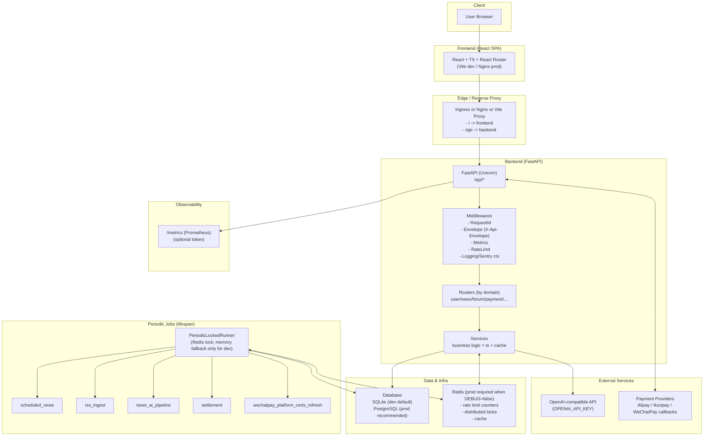

# 技术栈与架构（Tech Stack & Architecture）

## 1. 技术栈（含关键版本来源）

> 版本以仓库文件为准：`backend/requirements.txt`、`backend/requirements-dev.txt`、`frontend/package.json`、`docker-compose*.yml`、`helm/baixing-assistant/*`。

### 1.1 后端（FastAPI）

- **语言**：Python 3.10+（CI 使用 3.11）
- **Web 框架**：FastAPI（`requirements.txt`: `fastapi>=0.109.0`）
- **ASGI Server**：Uvicorn（`uvicorn[standard]>=0.24.0`）
- **数据验证/配置**：Pydantic v2（`pydantic[email]>=2.7.0`、`pydantic-settings>=2.2.0`）
- **ORM**：SQLAlchemy 2.x async（`sqlalchemy>=2.0.36`）
- **迁移**：Alembic（`alembic>=1.13.0`）
- **数据库驱动**：
  - SQLite：`aiosqlite==0.19.0`
  - PostgreSQL：`asyncpg>=0.29.0`
- **鉴权/密码**：
  - JWT：`python-jose[cryptography]==3.3.0`
  - 密码哈希：`passlib==1.7.4`（PBKDF2-SHA256）
- **AI & RAG（可选）**：
  - `openai>=1.30.0` + `httpx>=0.27.0`
  - `langchain>=0.2.0`、`langchain-openai>=0.1.0`、`langchain-chroma>=0.1.0`
  - `chromadb>=0.5.0`
  - `tiktoken>=0.7.0`
- **缓存/锁**：`redis>=5.0.0`
- **文档处理**：`pypdf==3.17.1`、`docx2txt==0.8`、`reportlab>=4.0.0`

### 1.2 前端（React SPA）

- **React**：`react 19.2.3`、`react-dom 19.2.3`
- **TypeScript**：`5.9.3`
- **构建工具**：`vite 7.2.7`
- **路由**：`react-router-dom 7.10.1`
- **数据请求/缓存**：`@tanstack/react-query 5.90.12`
- **HTTP**：`axios 1.13.2`
- **样式**：TailwindCSS 4（`tailwindcss 4.1.18`）
- **E2E**：Playwright（`@playwright/test 1.57.0`）

### 1.3 部署与基础设施

- **Docker Compose（演示）**：`docker-compose.yml`
  - DB：`postgres:15-alpine`
  - backend：Uvicorn reload
  - frontend：容器端口 3000
- **Docker Compose（生产示例）**：`docker-compose.prod.yml`
  - Redis：`redis:7-alpine`（启用 requirepass）
  - backend：Uvicorn workers=4
- **Kubernetes**：Helm Chart `helm/baixing-assistant`
  - Ingress：默认 `/api` -> backend，`/` -> frontend
  - Secret/ExternalSecret：支持注入后端敏感配置

---

## 2. 架构形态（总体）

- **仓库形态**：单仓库（Monorepo）
  - `backend/`：后端服务（FastAPI）
  - `frontend/`：前端应用（React）
  - `helm/`：K8s 部署
- **系统架构**：典型的 **前后端分离 + 后端单体（Modular Monolith）**
  - 后端按业务域拆分 router/service/model/schema，属于“分层架构（Layered Architecture）”
  - 前端为 SPA，通过 `/api` 与后端通信
- **API 组织**：FastAPI 统一前缀 `/api`，模块化路由聚合（`backend/app/routers/__init__.py`）

## 2.1 架构总览图（Overview Diagram）

> 目标：用一张图让专家快速理解组件边界、流量入口、生产依赖与关键门禁。

关键不变量（面向生产/交付）：

- **API 入口**：后端统一挂载在 `/api`（`backend/app/main.py`）。
- **生产门禁**：当 `DEBUG=false`：
  - Redis 必须可用（不可用启动失败）。
  - 默认启用 Alembic head 门禁（schema 不在 head 启动失败）。
- **Secrets 红线**：`OPENAI_API_KEY`、`JWT_SECRET_KEY/SECRET_KEY`、`PAYMENT_WEBHOOK_SECRET` 等必须走环境变量/Secret Manager 注入；禁止写入 SystemConfig。
- **周期任务**：周期任务通过 `PeriodicLockedRunner` + 分布式锁运行，生产多副本必须依赖 Redis 锁避免重复执行。

进一步阅读（工程侧权威入口）：

- `../TECH_SPEC.md`：环境变量、门禁与运行模式矩阵。
- `../DATABASE.md`：迁移规范与 DB 运维 Runbook。

---

## 3. 后端分层与职责划分

### 3.1 Router 层（HTTP 入口）

- 位置：`backend/app/routers/*`
- 职责：
  - 接收请求、校验参数（Pydantic/Query）
  - 权限与依赖注入（`get_current_user`/`require_admin`）
  - 组装响应结构（部分支持 Envelope）

### 3.2 Service 层（业务逻辑）

- 位置：`backend/app/services/*`
- 职责：
  - 业务规则与事务边界（如支付落库、论坛审核策略、News AI pipeline）
  - 数据聚合与缓存（例如 News hot/recommended cache、论坛 content filter cache）

### 3.3 Model 层（数据模型）

- 位置：`backend/app/models/*`
- 职责：SQLAlchemy ORM 模型定义（表结构权威来源）

### 3.4 Schema 层（DTO/请求响应模型）

- 位置：`backend/app/schemas/*`
- 职责：请求体/响应体的 Pydantic 模型

---

## 4. 数据库策略与迁移策略

- 默认 SQLite：`DATABASE_URL=sqlite+aiosqlite:///./data/app.db`
- 生产推荐 PostgreSQL：并通过 Alembic 管理迁移
- `backend/app/database.py:init_db()` 在启动时会：
  - 当 `DEBUG=false` 且未设置 `DB_ALLOW_RUNTIME_DDL=1`：仅做 **Alembic head 门禁**（schema 未到 head 则启动失败并提示迁移命令）
  - 当 `DEBUG=true` 或设置 `DB_ALLOW_RUNTIME_DDL=1`：允许执行 `Base.metadata.create_all()` 与少量运行时 DDL 兜底（便于本地开发/应急）

> 风险提示：`create_all + 自修复` 与 Alembic 并存，会带来“结构演进一致性”的长期风险；建议最终以 Alembic 为唯一迁移通道。

---

## 5. 安全与合规设计（关键点）

- **JWT**：token 里 `sub=<user_id>`（`backend/app/utils/security.py`）
- **Secrets 不入库**：`/api/system/configs` 对敏感 key/value 做服务端拦截（`backend/app/routers/system.py`）
- **生产环境强校验**：`DEBUG=false` 时校验 `SECRET_KEY` 与 `PAYMENT_WEBHOOK_SECRET`（`backend/app/config.py`）
- **限流**：Redis 优先（`INCR`+`EXPIRE`），不可用时内存兜底（`backend/app/utils/rate_limiter.py`）；生产 `DEBUG=false` 时强制要求 Redis 可用

---

## 6. 可观测性与运维

- 代码中存在 Prometheus metrics 相关模块（`backend/app/services/prometheus_metrics.py`）
- 周期任务执行会记录 job 指标（`backend/app/main.py`）
- 管理后台提供日志/运维状态页面（前端 `frontend/src/pages/admin/*`；后端 `/api/system/*`、`/api/news/admin/*`）
