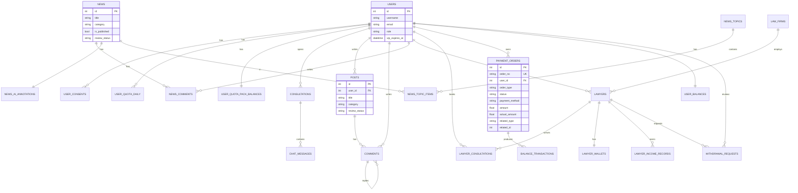

# 数据库设计（Schema / ER Diagram）

> 数据库结构主要由 SQLAlchemy ORM 模型定义（`backend/app/models/*`）。默认 SQLite（本地开箱即用），生产推荐 PostgreSQL。

## 1. 表/集合清单（按业务域）

### 1.1 用户与合规

- `users`：用户
- `user_consents`：用户协议同意记录（terms/privacy/ai_disclaimer）
- `user_quota_daily`：每日用量（ai_chat_count / document_generate_count）
- `user_quota_pack_balances`：次数包余额（ai_chat_credits / document_generate_credits）

### 1.2 AI 咨询

- `consultations`：咨询会话
- `chat_messages`：会话消息

### 1.3 论坛

- `posts`：帖子
- `comments`：评论（支持 parent_id 自关联）
- `post_likes`：帖子点赞
- `comment_likes`：评论点赞
- `post_favorites`：帖子收藏
- `post_reactions`：帖子表情反应

### 1.4 新闻与 News AI

- `news`：新闻
- `news_comments`：新闻评论
- `news_topics`：专题/合集
- `news_topic_items`：专题-新闻关联
- `news_favorites`：新闻收藏
- `news_view_history`：新闻浏览历史
- `news_subscriptions`：订阅
- `news_sources`：RSS 来源
- `news_ingest_runs`：采集运行记录
- `news_ai_annotations`：News AI 标注结果（summary/risk/keywords/highlights 等）
- `news_versions`：新闻版本快照
- `news_ai_generations`：AI 工作台生成记录
- `news_link_checks`：链接检查记录

### 1.5 律所/律师与咨询

- `law_firms`：律所
- `lawyers`：律师
- `lawyer_verifications`：律师认证申请
- `lawyer_consultations`：用户预约咨询
- `lawyer_consultation_messages`：咨询留言
- `lawyer_reviews`：律师评价

### 1.6 知识库

- `legal_knowledge`：法条/案例/法规/解释
- `knowledge_categories`：知识分类
- `consultation_templates`：咨询模板

### 1.7 文书

- `generated_documents`：生成并保存的文书
- `document_templates`：文书模板（key）
- `document_template_versions`：模板版本（发布/回滚用）

### 1.8 通知、系统与统计

- `notifications`：用户通知
- `system_configs`：系统配置（禁止存 secrets）
- `admin_logs`：管理员操作日志
- `search_history`：搜索历史
- `user_activities`：用户行为追踪
- `page_views`：页面访问聚合统计

### 1.9 日历与反馈

- `calendar_reminders`：日历提醒
- `feedback_tickets`：反馈工单

### 1.10 支付与资金

- `payment_orders`：支付订单
- `user_balances`：用户余额
- `balance_transactions`：余额流水
- `payment_callback_events`：支付回调事件审计（provider+trade_no 唯一）

### 1.11 律师结算

- `lawyer_wallets`：律师钱包
- `lawyer_income_records`：律师收入记录（可关联 consultation/order_no）
- `lawyer_bank_accounts`：律师收款账户
- `withdrawal_requests`：提现申请

---

## 2. 主要关联关系（核心）

- **用户（users）**

  - `user_consents.user_id -> users.id`
  - `user_quota_daily.user_id -> users.id`
  - `user_quota_pack_balances.user_id -> users.id`
  - `notifications.user_id -> users.id`（另有 `related_user_id`）

- **AI 咨询**

  - `consultations.user_id -> users.id`（可空：游客）
  - `chat_messages.consultation_id -> consultations.id`

- **论坛**

  - `posts.user_id -> users.id`
  - `comments.post_id -> posts.id`
  - `comments.user_id -> users.id`
  - `comments.parent_id -> comments.id`
  - `post_likes.post_id -> posts.id`、`post_likes.user_id -> users.id`

- **新闻**

  - `news_comments.news_id -> news.id`、`news_comments.user_id -> users.id`
  - `news_ai_annotations.news_id -> news.id`
  - `news_ai_annotations.duplicate_of_news_id -> news.id`
  - `news_topic_items.topic_id -> news_topics.id`、`news_topic_items.news_id -> news.id`

- **律所/律师**

  - `lawyers.user_id -> users.id`（可空）
  - `lawyers.firm_id -> law_firms.id`
  - `lawyer_consultations.user_id -> users.id`、`lawyer_consultations.lawyer_id -> lawyers.id`

- **支付/订单**

  - `payment_orders.user_id -> users.id`
  - `balance_transactions.user_id -> users.id`、`balance_transactions.order_id -> payment_orders.id`
  - `user_balances.user_id -> users.id`（一对一）
  - `payment_orders.related_type/related_id`：多态关联（例如 `lawyer_consultation`）

- **结算**
  - `lawyer_wallets.lawyer_id -> lawyers.id`
  - `lawyer_income_records.lawyer_id -> lawyers.id`
  - `withdrawal_requests.lawyer_id -> lawyers.id`
  - `withdrawal_requests.admin_id -> users.id`

---

## 3. Mermaid ER 图（简化版）

> 该图仅覆盖“主干关系”，用于专家快速理解。完整字段/索引/约束以 ORM 模型为准。

---

## 4. 迁移与一致性说明

- Alembic：`backend/alembic/*`（当前仓库包含至少一个 migration：news workbench 表）
- `backend/app/database.py:init_db()`：在启动时会 `create_all` 并对 SQLite/PG 做兜底增量 DDL。

建议（面向长期演进）：

- 逐步减少 `init_db()` 中的 DDL 自修复范围
- 将所有结构演进（新增表/列/索引/约束）沉淀到 Alembic migration
